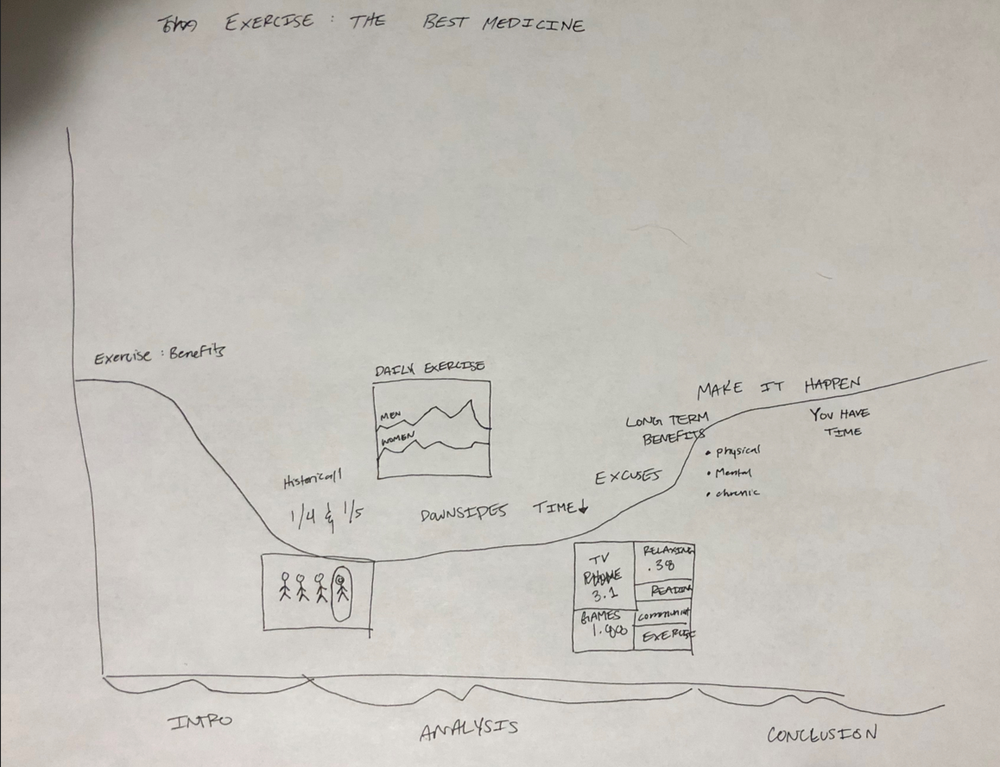
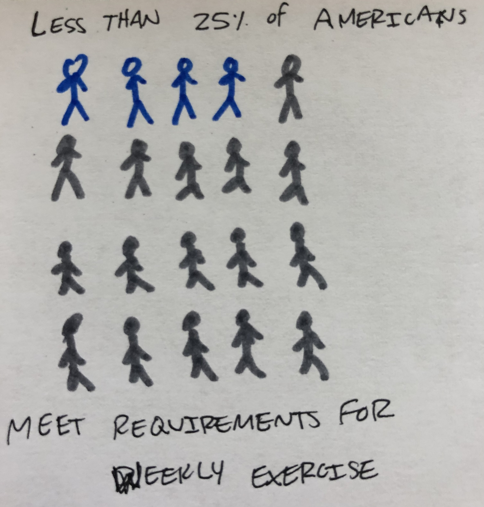
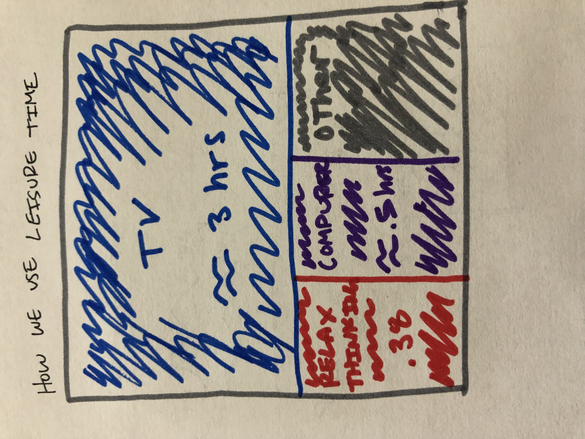
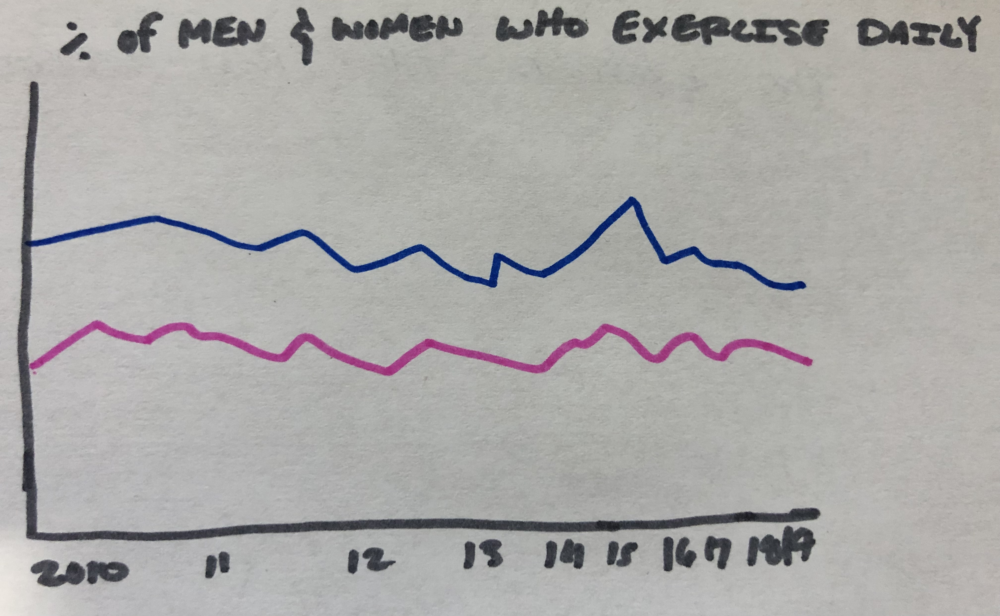

# Final Project Page

## Outline
What I want to show is that many of us do not get the proper exercise. The negative impact of not getting enough exercise. The benefits of exercising. Then a call to action of exercising more. This will probably be a bit tricky to get data on, but if I can I think I can create a compelling story for exercising more. 

Potential outline for story: Maybe exercise benefits in general > Where we are at currently in exercise statistics > Downsides of not exercising > Long-term benefits > Call to action

## Sketches

I like this visual because it shows how small of a percentage it actually is of those who get enough daily exercise. 

This graphic I like because it points out how we use our leisure time. The point of this chart would be to effectively make the point that we all have space in our day to exercise. We just have not prioritized it. I particularly like how it emphasizes how much TV we watch. 

I am still playing with how to use this data or if it is even usable. I like that it shows the data over time but we have more or less stayed pretty constant. Which is what I would say is the problem. As a country we have been and still are in pretty low percentages. 

## Data
<a href="https://www.cdc.gov/nchs/data/nhsr/nhsr112.pdf">CDC National Health Statistics Report</a> 
Shows the percent of adults age 16-64 who met the CDC recommended time for exercise.  
<a href="https://www.cdc.gov/chronicdisease/resources/publications/factsheets/physical-activity.htm">CDC: Lack of Physical Exercise</a> 
This is an artical from the CDC highlighting the key points that only 1 in 4 adults and 1 in 5 high school aged kids are getting the adequate and recommended amount of exercise. This will be used to illustrate the low percentage of Americans who get adequate exercise.  
<a href="https://www.bls.gov/tus/a1-2019.pdf">bls.gov data on how we spend our time</a> 
This shows how we spend our time. It as survey that shows how most Americans spend all their time. The important aspects here are leisure activities. I want to use this data as motivating evidence that we do indeed have time to exercise we just have to make it happen.  
<a href="https://www.cdc.gov/nchs/data/hestat/obesity-adult-17-18/overweight-obesity-adults-H.pdf">CDC Overweight, Obesity, and Severe Obesity in US over time</a> 
This shows the trend over time of how Americans have increased in weight over time. Not sure if I will use this but if I do if be to show that there is a trend towards unhealthy behaviors and one of the side effects of not exercising.  
<a href="https://www.bls.gov/tus/charts/leisure.htm">BLS: Leisure time on an average day</a> 
Similar to one mentioned above. Depicts how we use our time.  

## Medium and Method
The medium I am assuming I will use is Shorthand. We have not gone over it in class yet, but it was discussed that it will. 
It was said most students do end up using shorthand so I will probably do that as well. 

To finish my final project, first I need to find some more data. I think I can do this through the libray, I just need to contact
someone there to see where else I can be looking. I have accumulated some data sources though that I think are relevant to the topic.
Next, I will want to make sure my story outline makes sense, get some feedback on it from others to how I can improve it. Next, I 
will create the data visualizations for the story and have those critiqued to see where they can be improved and if they help the 
story. Then I wll work in shorthand to get it all up looking nice and pretty. Then I will rehearse for my final presentation. 

Part II of Final Project

<a href="https://infogram.com/1b7d20f8-93d0-49ed-9e20-096d3107e40b" style="color:#989898!important;text-decoration:none!important;" target="_blank">Pictoral Chart</a> <a href="https://infogram.com" style="color:#989898!important;text-decoration:none!important;" target="_blank" rel="nofollow">Infogram</a>

  <object class='tableauViz'  style='display:none;'><param name='host_url' value='https%3A%2F%2Fpublic.tableau.com%2F' /> 
  <param name='embed_code_version' value='3' /> 
  <param name='site_root' value='' />
  <param name='name' value='Tab_TimeSpending&#47;HowWeSpendOurLeisureTime2020' />
  <param name='tabs' value='no' />
  <param name='toolbar' value='yes' />
  <param name='animate_transition' value='yes' /><param name='display_static_image' value='yes' />
  <param name='display_spinner' value='yes' />
  <param name='display_overlay' value='yes' />
  <param name='display_count' value='yes' />
  <param name='language' value='en-US' />
  <param name='filter' value='publish=yes' />
  </object>

                

  <object class='tableauViz'  style='display:none;'>
    <param name='host_url' value='https%3A%2F%2Fpublic.tableau.com%2F' />
    <param name='embed_code_version' value='3' />
    <param name='site_root' value='' />
    <param name='name' value='Tab_TimeSpending2&#47;HowWeSpendOurLeisureTime2020' />
    <param name='tabs' value='no' />
    <param name='toolbar' value='yes' />
    <param name='animate_transition' value='yes' />
    <param name='display_static_image' value='yes' />
    <param name='display_spinner' value='yes' />
    <param name='display_overlay' value='yes' />
    <param name='display_count' value='yes' />
    <param name='language' value='en-US' />
    <param name='filter' value='publish=yes' />
  </object>
   
  

  <noscript>
  
  </noscript><object class='tableauViz'  style='display:none;'>
  <param name='host_url' value='https%3A%2F%2Fpublic.tableau.com%2F' />
  <param name='embed_code_version' value='3' /> 
  <param name='path' value='shared&#47;64FNCCGMS' /> 
  <param name='toolbar' value='yes' />
  <param name='static_image' value='64&#47;64FNCCGMS&#47;1.png' />
  <param name='animate_transition' value='yes' />
  <param name='display_static_image' value='yes' />
  <param name='display_spinner' value='yes' />
  <param name='display_overlay' value='yes' />
  <param name='display_count' value='yes' />
  <param name='language' value='en-US' />
  <param name='filter' value='publish=yes' />
  </object>

  <object class='tableauViz'  style='display:none;'>
    <param name='host_url' value='https%3A%2F%2Fpublic.tableau.com%2F' />
    <param name='embed_code_version' value='3' />
    <param name='site_root' value='' />
    <param name='name' value='BDNF_chart&#47;PercentChangeinBDNFbyExerciseType' />
    <param name='tabs' value='no' />
    <param name='toolbar' value='yes' />
    <param name='animate_transition' value='yes' />
    <param name='display_static_image' value='yes' />
    <param name='display_spinner' value='yes' />
    <param name='display_overlay' value='yes' />
    <param name='display_count' value='yes' />
    <param name='language' value='en-US' />
    <param name='filter' value='publish=yes' />
  </object>

         

24 year old, female
1. First reaction to the visualization
- That it is crazy. Makes me wonder if it is true because it is so low.
3. What do you like?
- Easy to understand. Immediately know what it is trying to tell me. 
5. What don't you like?
- Don't know. 
7. Does anything confuse you?
- No, you have to use the legend to know exactly what it is saying. The colors don't make it obvious. 
9. Is there anything unnecissary?
- No. 
11. Would anything else be helpful?
- Not really. 
13. What do you take from the visual?
- That americans don't exercise
15. Title?
- Long. Gets to the point. Don't know how else you would do it. Feels a bit long. 

1. No way! But then ya.. 
2. It is easy to understand. Wish I could see the other three blocks. 
3. Nothing to pressing. I like that it shows the minutes. 
4. Nothing confusing. 
5. Don't need the measure values highlight color. 
6. No
7. That we watch way too much TV
8. Good. 

1. The bar chart maybe shows it better but I like that treemap has it broken down into more categories. 

1. What are the labels? Had to look at it for a second. Interesting the difference it does make. Shows a big gap. 
2. can the obvious difference. Anything is better than nothing. 
3. Labels. 
4. Labels. Why is the moderate the highest?
5. No. 
6. New Labels haha. 
7. Any exercise is better than nothing
8. Good. Boring.

53, Male
1. First Reaction
I like it. A good visual. Big difference. 
2. What do you like?
Good visual. Not a lot of people are exercising. I am a grey. 
3. What don't you like?
How many people are actually on there? Title is a bit long? 
Americans meeting CDC criteria? Only 25% of Americans are Exercising?
Over 75% of Americans Are Not Exercising. 
Make legend bigger. 
Center the title.
4. Does anything confuse you?
No.
5. Is there anything unnessicary?
No. 
6. Would anything else be helpful?
Bigger Legend. 
7. What is the point you take from the graph?
That people don't exercise. Surprises me. We have a problem. 

1. First Reaction
Little more difficult to read. Don't like the colors. I like pie Charts in these situations. Round. 
2. What do you like?
Nothing.... Measure weight values. Different ages is cool. Surprising.. Maybe 
3. What don't you like?
Communicating/Socialing over talking. Rec over Outdoors. 
Can the labels be bigger. 
4. Does anything confuse you?
Not really. 
5. Is there anything unnessicary?
Bold title. "How we use our leisure time" in minutes as a subtitle. 
6. Would anything else be helpful?

7. What is the point you take from the graph?
We waste a lot of time. That we have time. 

Like the bar graph better. 
48, Woman
1. First Reaction
Crazy the increase. Surprised the moderate was the highest. 
2. What do you like?
Easy to read. 
3. What don't you like?
Don't know what CON means. Think of a better title? "Give your brain the food it needs. BDNF.", "Moderate exercise can help boosts BDNF"
4. Does anything confuse you?
The labels.
5. Is there anything unnessicary?
Don't think so. 
6. Would anything else be helpful?
Add the number. Why does it say F1 on hover, and give it a % for visual. 
7. What is the point you take from the graph?
Even moderate exercise helps a lot... BDNF. 
