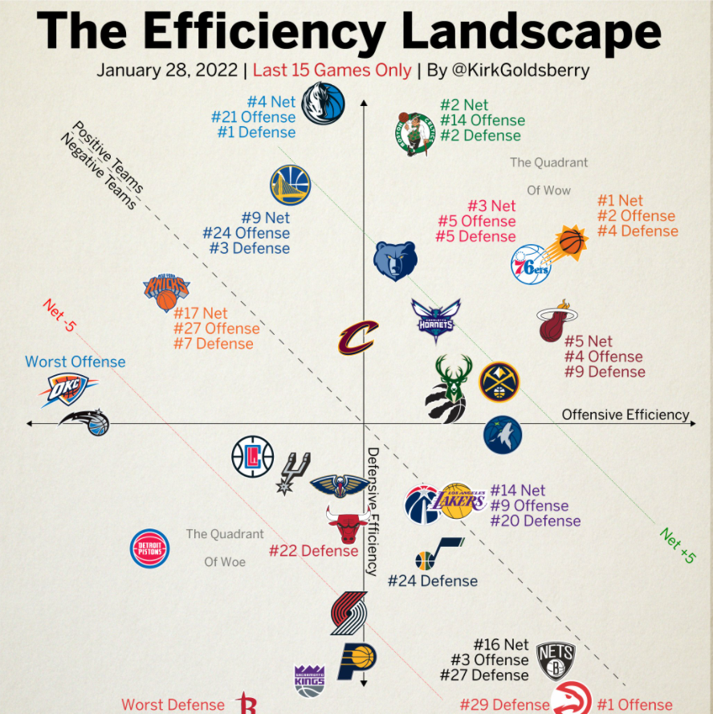
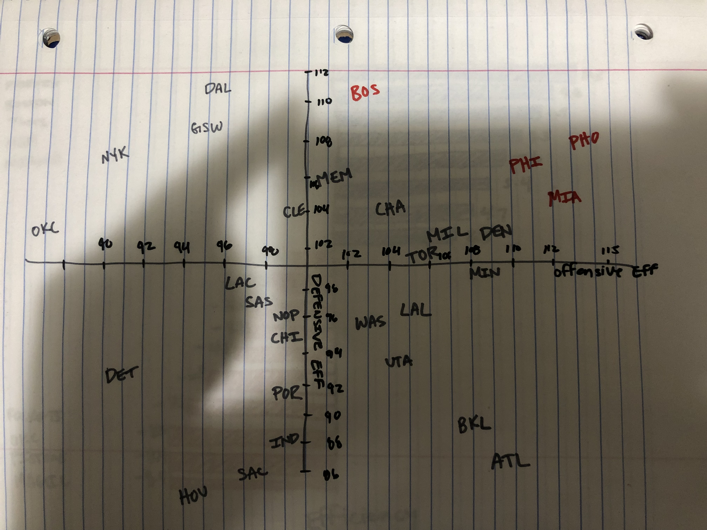
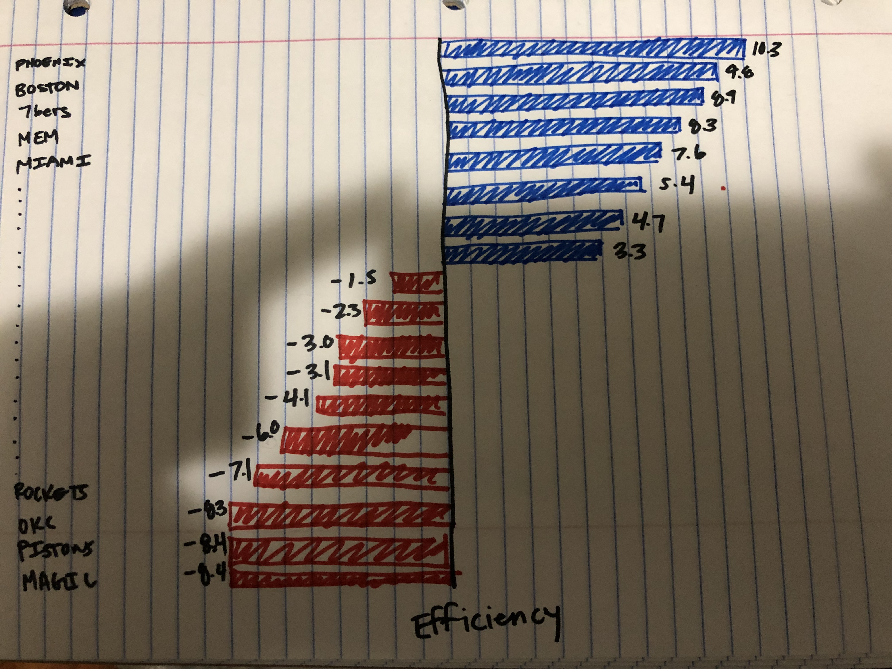
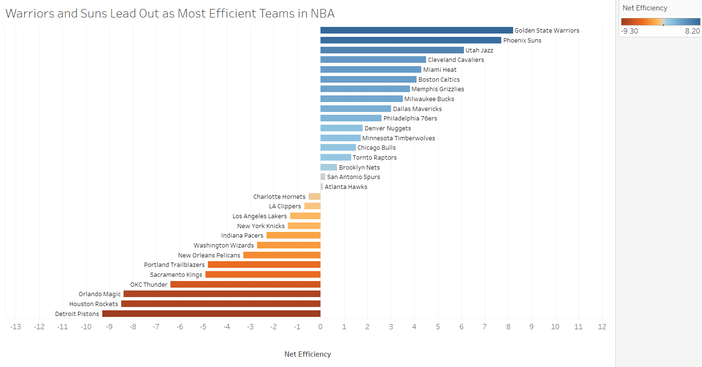

# Homework 3 and 4

## Data Visualization to Critique: The Efficiency Landscape

## Critique of the Visualization
The overall summary of the chart is that for someone who has experience with NBA the chart 
is pretty cool. I consider myself as someone who follows the NBA pretty closely, but this 
still took me a secong to get a real idea of what was going on, so the readability needs some
work. 

The chart looks a bit messy. There are axes, diagonal lines, some random labels, and some
random text. I think it could be cleaned up a bit. However, I do really like the ability 
to use team logos as icons. This could backfire though if your reader has no idea who the
teams are. 

I do think after you look at it for a second the chart does deliver the overall message 
well. You can see which teams are performing well offensively, defensively, and who has
the biggest net efficiency. I don't mind some of the rankings, but they seem random. It 
would be better in my opinion if they just highlighted the top particular teams. 

The other point I would add is tick marks with numbers so we can see how efficient the 
teams actually are. We can see that some are more and less effiecient but being able to
put that into some number form would be nice for readibility and comparing. 

## Wireframe a solution

The first sketch is me trying to represent the data in a bit of a cleaner way and see if
I feel like it makes it easier to read. Basically, the same approach taken originally but
seeing if I can clean it up a bit. 

The second one, I took some of the emphasis off the defensive and offensive efficiencies. 
I focused mainly on net efficiencies which really brings to light who is being the most 
efficient anyway. This is the point I think the author is trying to make and I think it 
helps get it across. 

## Test the solution
### Sister
The first person I interviewed was my sister. She knows very little about basketball so I 
hoped it would give a fresh perspective. Even with the changes I made in my first sketch
it took a while for her to see what exactly the point of the graph was. Her response to 
"What do you think this is" was "some kind of city or state effecincies data". She then
asked why there was no title or labels. She mentioned having the points in red made her
believe they were doing poorly when in reality they were the best. 

I gave here some help because I left off a title that this was NBA basketball data and 
it became a little more clear to her. I asked about intended audience and she said people
who are well versed in basketball because this chart did not make sense to her even with
that knowledge. 

We looked at the second chart and she said now having the knowledge that this was about 
basketball that it made it easier to interpret. Likes the data points by the bars. Hard
to associaly bars with team. Nice for comparison. Seems more intuitive. 

Summary of Sketch 1 from Sister: 
- Have a title, because without it there is no way to know what is happening. 
- Likes the idea of having best teams stand out but change the color. 
- Data points need to be more readable
- Tick marks help readability but also crowd the data. 

Summary of Sketch 2 from Sister:
- More readable
- Hard to pin point team
- Needs title
- Needs Labels
- Visually easier to understand for someone who knows little about NBA
- Easier for comparison
- Colors are good.
- What is net efficiency?

### Wife
Full disclosure, I showed my wife the original graph earlier so she had some idea what
the charts were going to be about. But it was good for comparison to see if it was easier
to understand. 

We looked at the first sketch are her first response was that it was easier to read because
there was not as much happening. Like my sister she asked why those 4 teams are in read if 
they are the good ones. Not as fun to look at as original but easier to understand. Likes
tick-marks but they need to be cleaned up. Overall, she said even though it is more readable
it is a step down from the original. 

We moved on to the second sketch and her first response was that it is very easy to understand 
this way. Also, that it is easier to make comparisons between teams. She liked having two colors
to separate positive and negative. Mentioned the need for title. When I asked what she thought the
chart was trying to tell her she said, "I don't know. Who the most efficient teams are?". So that 
was a bit discouraging. But good to think about because it doesns't really highlight anything specific. 
I asked her what she would change and she said the teams are far away from their numbers. The negative
teams are easy to see but the positive are more difficult. 

Summary of sketch 1 from wife: 
- Change color of best teams
- Not as fun to look at
- clean up tick-marks
- hard to understand when a point is good or bad. 

Summary of sketch 2 from wife: 
- Easier to understand
- Good for comparisons
- Two colors is good
- Needs a title
- No real story being told. Doesn't highlight anything.
- Teams are far away from numbers. 

### Group Feedback from Class
They looked at a draft I had been working on in Tableau

- What worked: Intuitive and Simple. Easy to understand compared to original. 
- What didn't work: Colors, change colors, make title black, highlight
  top 2 or 3 and bottom 2 or three teams. Add a subtitle. Explanation of efficiency would help. 
- What questions came up: What is negative efficiency..?
- What new inspirations arose: I thought the color was pretty good but it seemed that it could be improved upon because it did not give any real meaning. Also, the idea of showing the top 3 and bottom 3 gave it more pop.

# Build Your Solution

  <object class='tableauViz'  style='display:none;'><param name='host_url' value='https%3A%2F%2Fpublic.tableau.com%2F' />
  <param name='embed_code_version' value='3' />
  <param name='site_root' value='' />
  <param name='name' value='Homework34_16442895089470&#47;Final' />
  <param name='tabs' value='no' />
  <param name='toolbar' value='yes' />
  <param name='animate_transition' value='yes' />
  <param name='display_static_image' value='yes' />
  <param name='display_spinner' value='yes' />
  <param name='display_overlay' value='yes' />
  <param name='display_count' value='yes' />
  <param name='language' value='en-US' />
  <param name='filter' value='publish=yes' />
  </object>

  
